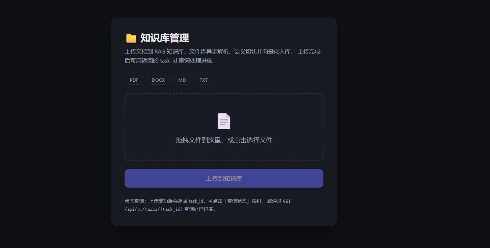
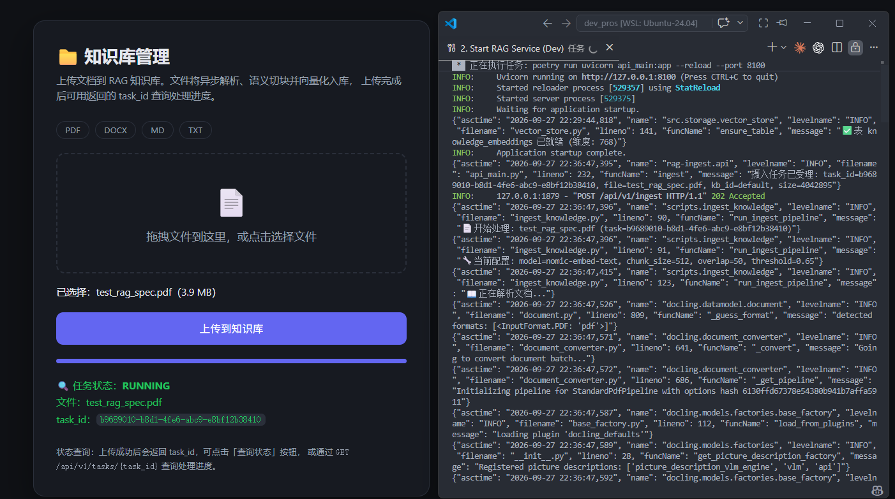
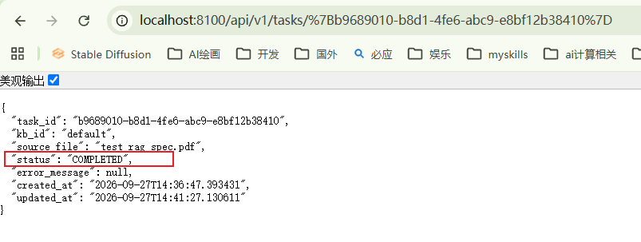
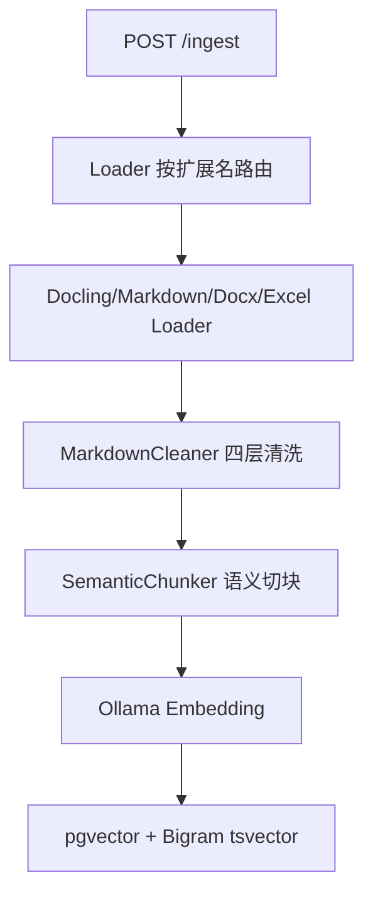
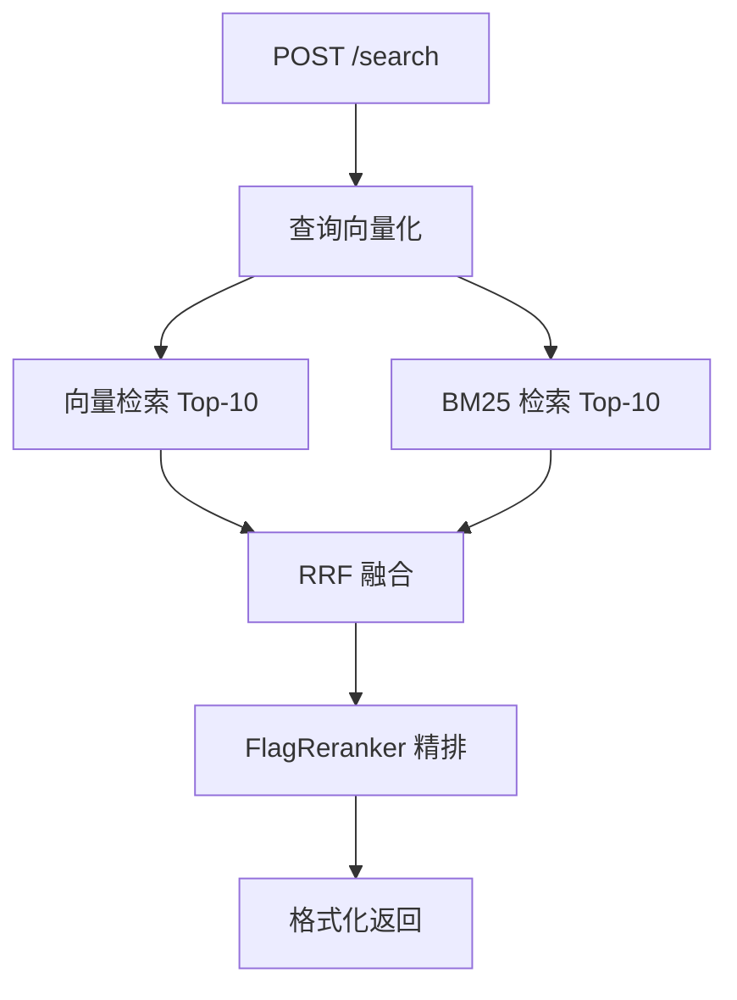

# rag-ingest-gateway

独立部署的 RAG 摄入 + 检索微服务：支持多格式文档解析（PDF/Word/Excel/Markdown）、语义切块、双模型 Embedding、三阶段混合检索（向量 + BM25 + RRF + Reranker）。**它是主服务 [AdaptiveSearchAgent](https://github.com/suimochuansheng/AdaptiveSearchAgent) 的 RAG 子服务，被主服务通过 HTTP（`POST /api/v1/search`）单向调用。**

---
摄入文档页面


添加文档并上传中


执行完查询该task_id状态


---

## 解决什么问题

企业内部文档格式多样（PDF、Word、Excel、Markdown），直接喂给大模型会超出上下文窗口，还会丢失表格、标题、图片等结构信息。这个服务把文档完整走一遍「解析 → 清洗 → 语义切块 → 向量化 → 入库」，对外只暴露一个标准检索接口。主服务调用它获取内部知识库内容，与在线搜索形成「内部知识 + 互联网」双路增强。

---

## 核心亮点

### 1. 多格式 Loader 体系（IR 中间表示）
所有格式统一抽象为 `DocumentLoader.load() -> (blocks, metadata)`，下游清洗/切块/向量化完全不感知来源格式，新增格式只需写一个 Loader。**支持 5 种格式**。
代码：`phase1/src/loaders/base.py:5`、`phase1/src/loaders/docling_pdf_loader.py`

### 2. 语义切块（SemanticChunker）
标题与正文强制合并（杜绝孤立标题块）、表格整体保留不切、标题注入每个子块前缀、中文空格清洗。**chunk_size=512 / overlap=50 / 最小块 50 字符**。
代码：`phase1/src/chunking/semantic_chunker.py:175`

### 3. 中文 Bigram 零依赖 BM25
PostgreSQL `simple` 分词不识别无空格中文，用字符级 bigram 预处理（"你好世界"→"你好 好世 世界"）让原生 `tsvector` 正常工作。**零外部依赖（不用 jieba/zhparser）**。
代码：`phase1/src/storage/vector_store.py:14`

### 4. 三阶段混合检索（向量 + BM25 + RRF + FlagReranker）
向量与 BM25 各取 Top-10 → RRF 融合排序 → 候选池放大 3 倍 → FlagReranker 交叉编码器精排，失败自动回退 RRF。**rrf_k=60、向量粗筛阈值 0.3**。
代码：`phase1/src/storage/vector_store.py:278`、`phase1/src/tools/rag.py:136`

### 5. 双模型 Embedding 表隔离
nomic-embed-text（768 维）与 bge-m3（1024 维）维度不同，用 `table_suffix` 分表存储，按 `model` 参数路由。**两套表：knowledge_embeddings / knowledge_embeddings_bgem3**。
代码：`phase1/src/tools/rag.py:65`、`phase1/src/storage/vector_store.py:47`

### 6. Reranker 兼容补丁（transformers 5.x）
FlagEmbedding 1.4.0 仍调用 transformers 5.14.1 已移除的 `prepare_for_model` API，运行时检测缺失后动态注入兼容实现。**不锁老版本、上游修复后补丁自动失效**。
代码：`phase1/src/tools/rag.py:49`

---

## 量化结果

| 指标 | 值 |
|---|---|
| 支持格式 | PDF / DOCX / XLSX / MD / TXT 5 种 |
| 知识库规模 | 约 60 文档 / 3028 chunks（nomic）/ 2996 chunks（bge-m3） |
| 切块参数 | chunk_size=512 / overlap=50 / 最小块 50 字符 |
| 检索模式 | 纯向量 / 混合检索（BM25 + 向量 + RRF + Reranker） |
| 单次 hybrid 检索 | 约 0.16s（Reranker 预热后） |

---

## 架构图

**摄入链路**



**检索链路**



---

## 技术栈

- **核心**：Python 3.11 / FastAPI / PostgreSQL + pgvector / Ollama
- **RAG**：Docling（PDF）/ FlagEmbedding（Reranker）/ nomic-embed-text + bge-m3（Embedding）/ Qwen-VL（图片描述）
- **工程**：Docker / pytest

---

## 快速开始

**前置依赖**：

- PostgreSQL（含 pgvector 扩展）+ Redis
- Poetry（Python 依赖管理）
- Ollama + 已下载模型 `nomic-embed-text`（默认）

```bash
# 1. 安装 Python 依赖
poetry install

# 2. 启动 RAG 服务（端口 8100）
poetry run uvicorn api_main:app --reload --port 8100
```

> 健康检查：`GET http://localhost:8100/health` 应返回 `{"status":"ok","service":"rag-ingest"}`

---

## 项目结构

```
rag-ingest-gateway/
├── api_main.py                    # FastAPI 入口（4 个端点）
├── phase1/
│   ├── scripts/ingest_knowledge.py  # 摄入流水线（可导入 + CLI）
│   └── src/
│       ├── loaders/               # 多格式 Loader（PDF/DOCX/XLSX/MD/TXT）
│       ├── cleaners/              # MarkdownCleaner 四层清洗
│       ├── chunking/              # SemanticChunker 语义切块
│       ├── embedding/             # Ollama 双模型嵌入
│       ├── storage/               # pgvector + Bigram BM25 + 任务审计
│       └── tools/                 # 检索编排 + Qwen-VL 图片描述
└── tests/                         # 测试套件
```

---

## 演进方向

当前版本聚焦 MVP 端到端跑通，以下是有明确方案、待落地的优化项：

- **表格 chunk 检索优化**：SemanticChunker 对表格整体保留不切，导致具体数值查询召回偏低。下一步按行拆分 + 表头注入，每行一个 chunk，表头拼到每行前面。
- **增量摄入**：同名文档上传会追加而非覆盖。下一步基于 `file_sha256` 判重（字段已入库），已存在的文件跳过、变更的删除旧块再插入。
- **溯源增强**：检索结果当前只回显文件名。下一步在元数据里绑定文档名 / 页码 / 章节，Writer 引用时标注来源。
